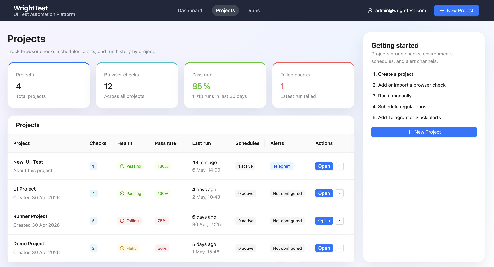
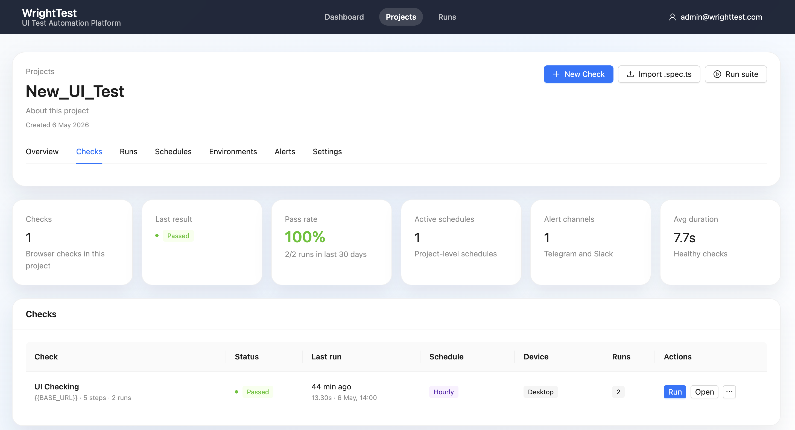
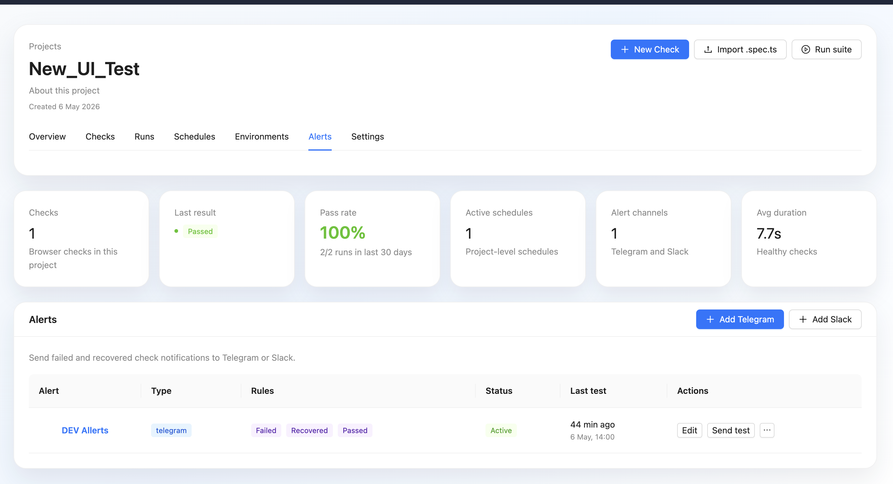
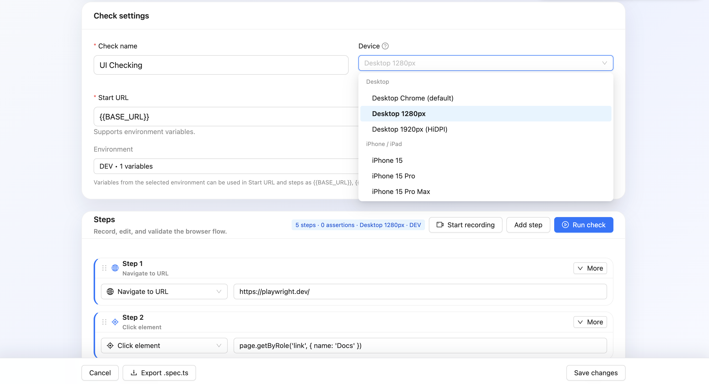
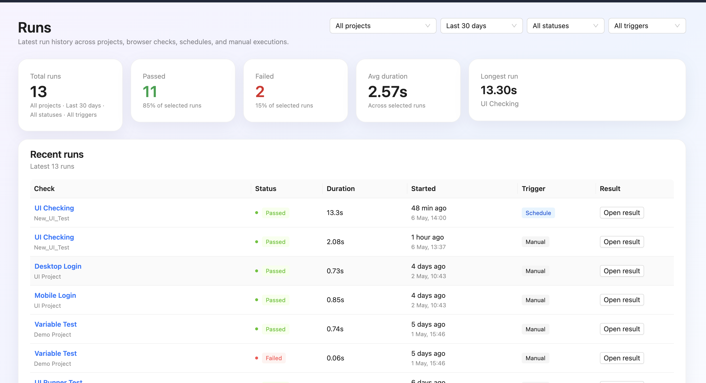
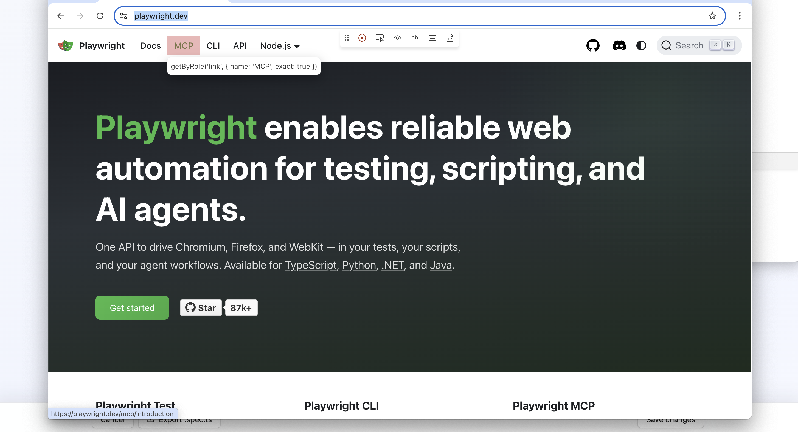
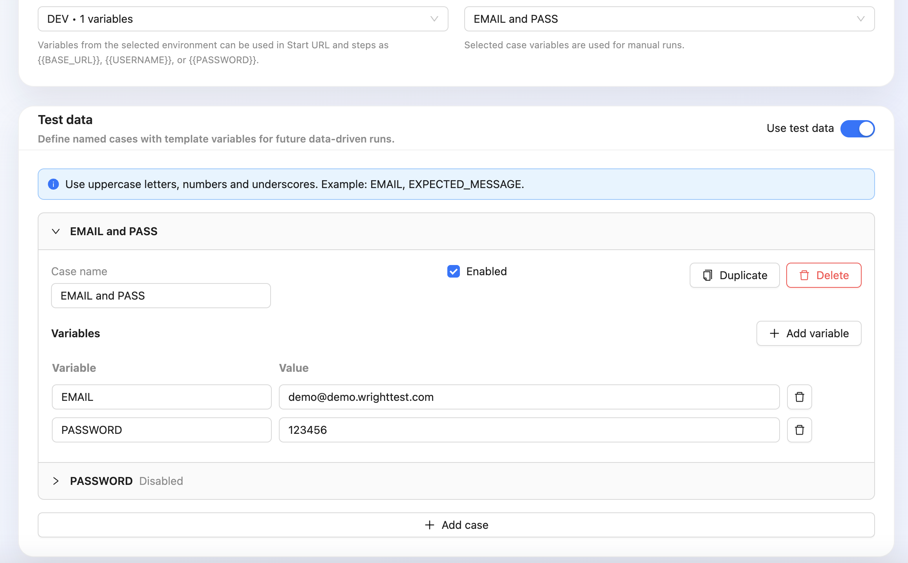
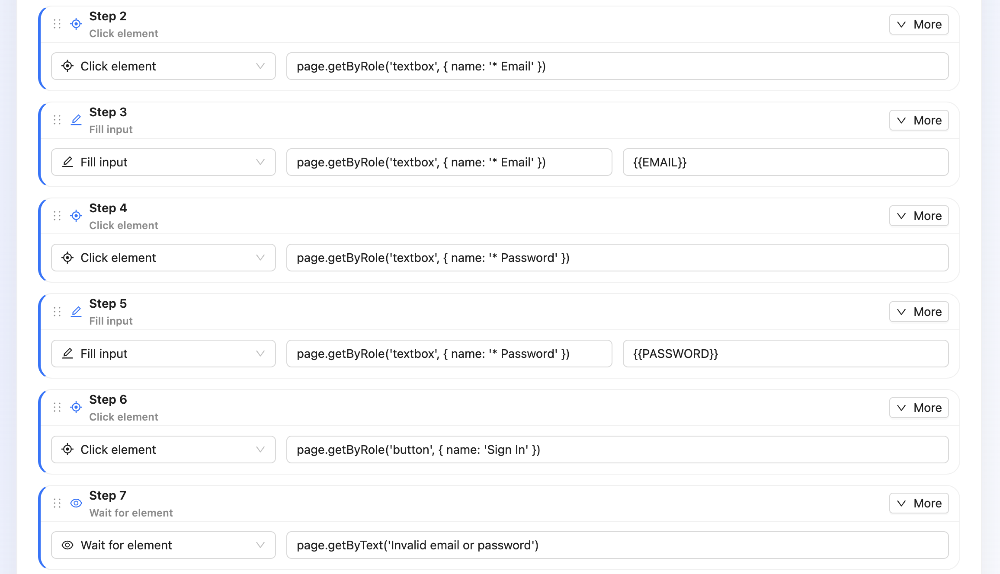

# 🎭 WrightTest

> Low-code UI test automation platform powered by Playwright.  
> Create, record, and run browser tests through a web interface - no code required.


[](https://github.com/AlexFilippov-it/wrighttest/stargazers)
[](https://github.com/AlexFilippov-it/wrighttest/commits/main)
[](https://github.com/AlexFilippov-it/wrighttest/actions/workflows/ci.yml?query=branch%3Amain)

## ✨ Features

- **Visual Recorder** - click through your app via noVNC, steps captured automatically
- **Smart Locators** - uses `getByRole`, `getByLabel`, `href` instead of fragile CSS paths
- **Assertions Builder** - `toBeVisible`, `toHaveText`, `toHaveURL` and more
- **Device Presets** - run desktop 1280px by default or emulate iPhone 15, Pixel 7, iPad and other devices
- **Environments** - `{{BASE_URL}}`, `{{PASSWORD}}` replaced at runtime per environment
- **Data-driven checks** - define named scenario cases, run one selected case, or queue all enabled cases as a batch
- **Scheduler** - cron-based automatic runs with full history per schedule
- **Suites** - group tests and run them with one click or on schedule
- **Trace Viewer** - built-in Playwright trace viewer after every run
- **Notifications** - Telegram / Slack alerts on FAILED
- **Export** - download a single `.spec.ts` or a runnable Playwright project `.zip`
- **Import** - paste existing Playwright script, get a visual test
- **Dashboard** - pass rate over time and flaky test detection

## How WrightTest compares

| Feature | WrightTest | Cypress | Selenium IDE | Playwright UI |
|---|---|---|---|---|
| No-code recorder | ✅ | ❌ | ✅ | ❌ |
| Docker one-command | ✅ | ❌ | ❌ | ❌ |
| Mobile emulation | ✅ | ⚠️ | ❌ | ✅ |
| Built-in scheduler | ✅ | ❌ | ❌ | ❌ |
| Export to `.spec.ts` | ✅ | ❌ | ❌ | ❌ |
| Export runnable project `.zip` | ✅ | ❌ | ❌ | ❌ |
| Self-hosted | ✅ | ✅ | ✅ | ❌ |
| Trace Viewer built-in | ✅ | ❌ | ❌ | ✅ |

## 🚀 Quick Start (Docker-first)

**Requirements:** Docker, Docker Compose

```bash
git clone https://github.com/AlexFilippov-it/wrighttest.git
cd wrighttest

cp .env.example .env
# Edit .env - set JWT_SECRET to a long random string (required)

docker compose up --build
```

| Service | URL |
|---|---|
| App | http://localhost:5173 |
| API | http://localhost:3000 |
| noVNC | http://localhost:6080 |

Default admin login is defined in `.env`:

- `ADMIN_EMAIL=admin@wrighttest.app`
- `ADMIN_PASSWORD=changeme`

On an empty database the seed also creates a `Docker Demo` project with two sample tests, a `DEV` environment, a `Smoke Test` suite, and an hourly schedule.

This path is the recommended first launch on any machine. The backend image is built on the Playwright-ready base image and includes the browser bundle, so no host browser or system library setup is required.

## 🌐 Live Demo

A public demo UI is available at:

- https://demo.wrighttest.com

Demo credentials:

- Email: `demo@wrighttest.com`
- Password: `demo`

The demo account has read-only access only.

## 🖥 Server Prerequisites

For a VPS or bare-metal deploy, make sure these are available first:

- Docker Engine
- Docker Compose V2 (`docker compose`)
- a reverse proxy such as nginx if you want a public domain
- free host ports for the published services if you are not proxying everything through nginx

Recommended Docker overrides for a server deploy:

- `FRONTEND_HOST_PORT`
- `BACKEND_HOST_PORT`
- `POSTGRES_HOST_PORT`
- `REDIS_HOST_PORT`
- `VNC_HOST_PORT`
- `NOVNC_HOST_PORT`

Keep container-internal ports unchanged; only adjust the host-facing ports and public URLs when needed.

## 🚀 Server Deployment

For a server deployment:

1. Copy `.env.example` to `.env`
2. Set `JWT_SECRET` to a long random value
3. Set `FRONTEND_URL` to your public domain or reverse-proxy URL
4. Set `VITE_BACKEND_URL` and `VITE_NOVNC_URL` to the URLs users should reach from the browser
   - local example: `http://localhost:6080`
   - reverse-proxy example: `/vnc`
5. Adjust `*_HOST_PORT` values if your VPS already uses ports like `3000`, `5432`, or `6379`
6. Run `docker compose up --build -d`

If you place nginx in front of the app, proxy the public frontend domain to the frontend container and route backend/API traffic to the backend container. The backend already exposes `/health` and `/health/db` for readiness checks.

## noVNC Local / Server Modes

WrightTest uses a single `VITE_NOVNC_URL` value and derives the websocket path from it at runtime.

### Local Development

Use this when noVNC is exposed directly on `localhost`:

```env
VITE_NOVNC_URL=http://localhost:6080
```

The recorder iframe connects to:

- `ws://localhost:6080/websockify`

### Server Behind Reverse Proxy

Use this when nginx exposes noVNC under a path prefix:

```env
VITE_NOVNC_URL=/vnc
```

The recorder iframe connects to:

- `wss://your-domain.example/vnc/websockify`

This keeps the container image unchanged and moves the deployment-specific part into configuration only.

## 🤖 AI Quick Start

If you are working with an AI coding agent, start here first:

- [AGENTS.md](./AGENTS.md)

It contains the canonical repo workflow, startup order, and environment rules for WrightTest.

## 🛠 Host Fallback (optional)

Use this only if you want to run the frontend with Vite and the backend on the host.

**Requirements:** Node.js 20+, PostgreSQL 16, Redis 7

```bash
git clone https://github.com/AlexFilippov-it/wrighttest.git
cd wrighttest

cp .env.example .env
# Edit DATABASE_URL for local PostgreSQL

npm install
npm run setup
cd backend && npx prisma migrate dev && npx prisma db seed && cd ..
npm run dev
```

`npm install` now runs a Playwright bootstrap step for Chromium and WebKit. On Ubuntu/Linux
it will also try to install system dependencies when the terminal session allows
it. If Playwright still cannot launch Chromium or mobile recording needs WebKit,
run the same bootstrap manually and then install Linux deps:

```bash
npm run setup
npx playwright install chromium webkit
sudo npx playwright install-deps chromium webkit
```

| Service | URL |
|---|---|
| Frontend | http://localhost:5173 |
| Backend | http://localhost:3000 |

If the host environment still reports missing Playwright libraries, rerun `npm run setup` once from the repo root. On Ubuntu/Linux this may fall back to `npx playwright install-deps chromium webkit` when needed.

## 🔄 Updating

```bash
git pull
docker compose up --build -d
```

On first launch or after resetting volumes:

```bash
cp .env.example .env
# Make sure JWT_SECRET is set to a long random value
docker compose up --build -d
```

Migrations apply automatically on startup. Existing projects, tests and run history are preserved in the Postgres volume.

## 🔧 Changing Ports

All ports are in `.env` - no hardcoded values in code:

```env
BACKEND_PORT=3001
FRONTEND_PORT=8080
NOVNC_PORT=6081
```

Then restart:

```bash
docker compose up --build -d
```

## 📸 Product Tour

<p align="center">
  
</p>
<p align="center"><em>Projects overview with health summaries, project status, and onboarding.</em></p>

<p align="center">
  
  
</p>
<p align="center"><em>Project workspace with checks, schedules, alerts, and operational summaries.</em></p>

<p align="center">
  
  
</p>
<p align="center"><em>Edit browser checks visually and review global execution history across projects.</em></p>

<p align="center">
  
</p>
<p align="center"><em>Live recording captures Playwright-ready selectors directly from the browser session.</em></p>

## 🧪 Data-driven Checks

WrightTest separates checks from test cases:

- **Check** - one browser scenario: URL, device, and steps.
- **Test case** - one named set of scenario variables for that check.
- **Run** - one execution of one check with one selected test case.
- **Run batch** - a grouped set of runs created by running all enabled test cases for one check.

This means a project can show `Checks: 1` while that check contains multiple test cases. The check is counted once because the browser flow and steps are shared; each enabled case creates its own run when executed in a batch.

Each test case has:

- a human-readable name
- an enabled/disabled state
- scenario variables such as `EMAIL`, `PASS`, `EXPECTED_MESSAGE`, or `EXPECTED_URL`

All variables are equal: they can describe form input, expected results, URLs, titles, search text, order numbers, or any other scenario value. Use them in the Start URL or step fields with the same `{{VARIABLE}}` syntax used by environments.

Example case:

```text
Wrong password
EMAIL=admin@test.com
PASS=123456
EXPECTED_MESSAGE=Invalid email or password
EXPECTED_URL=https://demo.wrighttest.com/login
```

Example steps:

```text
Fill {{EMAIL}}
Fill {{PASS}}
Assert text {{EXPECTED_MESSAGE}}
Assert URL {{EXPECTED_URL}}
```

For manual runs in the editor, select the case in **Check settings** next to the Environment selector, then run the check. If more than one case is enabled, use **Run all enabled cases** to queue a batch. Each case in that batch creates a separate `TestRun`, keeps its own variable snapshot, screenshots, trace, error, and step results, and runs through the existing worker.

On the project checks page, **Run** is data-aware: checks with one enabled case start a normal run; checks with multiple enabled cases queue a batch and open the batch result page.

WrightTest combines variables from the selected environment with variables from the selected test data case for that run. Test data case variables take precedence when the same variable name exists in both places. Empty strings are valid values, so a case can intentionally define `EMAIL=`.

Disabled cases are ignored by run actions and do not block variable diagnostics.

This keeps ordinary checks unchanged: if a check has no test data, it runs exactly as before.

## 🖥 Devices

If no device is selected, WrightTest uses the default desktop browser context (`1280x720`). The device selector only stores explicit overrides such as:

- `Desktop 1280px`
- `Desktop 1920px (HiDPI)`
- mobile and tablet presets from Playwright

There is no separate saved value for "Desktop default"; leaving the selector empty is the default desktop mode.

<p align="center">
  
  
</p>
<p align="center"><em>Create named data cases in the check editor, then select the enabled case to use for a manual run.</em></p>

## 📦 Export Playwright Project

Export a complete runnable Playwright project as a `.zip` archive.

The generated project includes:
- Playwright configuration
- ready-to-run test files
- `package.json`
- optional environment variable support
- minimal project structure for local IDE usage

After extraction:

```bash
npm install
npx playwright install
npx playwright test
```

<p align="center">
  
</p>
<p align="center"><em>Export a runnable Playwright workspace that opens directly in your IDE and runs locally without manual setup.</em></p>

## 👥 Project Roles

WrightTest supports project-level access roles to control who can edit, run, and manage a project.

### Editor

Editors can:
- create and edit checks
- run checks
- use recording
- manage schedules and environments
- export Playwright specs and projects
- view runs, screenshots, and traces

### Viewer

Viewers have read-only access.

Viewers can:
- view checks and steps
- inspect runs and results
- open screenshots and traces
- explore project structure

Viewers cannot:
- modify checks
- run checks
- start recording
- edit environments or schedules
- manage project members

<p align="center">
  
</p>
<p align="center"><em>Project-level roles keep Viewer accounts read-only while Editors can manage checks, schedules, environments, and exports.</em></p>

## 🏗 Architecture

```text
┌─────────────┐   POST /recordings/start   ┌──────────────────┐
│  noVNC      │ ─────────────────────────▶ │ playwright codegen│
│  (iframe)   │ ◀──── sessionId ─────────  │ headed browser   │
└─────────────┘                            └──────────────────┘
      │ clicks recorded as Steps
      ▼
┌─────────────┐   POST /tests/:id/run      ┌──────────────────┐
│ Step Editor │ ─────────────────────────▶ │ BullMQ + Redis   │
│ + Validate  │                            │ Worker queue     │
└─────────────┘                            └──────────────────┘
      │
Playwright headless
      │
┌─────────────┐   polling GET /runs/:id    ┌──────────────────┐
│ Run Result  │ ◀───────────────────────── │ Screenshots      │
│ Trace Viewer│                            │ Traces           │
└─────────────┘                            └──────────────────┘
```

## 📦 Stack

| Layer | Technology |
|---|---|
| Frontend | React + TypeScript + Vite + Ant Design |
| Backend | Node.js + Fastify + TypeScript |
| ORM | Prisma + PostgreSQL |
| Queue | BullMQ + Redis |
| Runner | Playwright (Chromium) |
| VNC | noVNC + Xvfb + x11vnc |
| Auth | JWT + bcrypt |
| Container | Docker Compose |

## 📋 Roadmap

- [ ] Network mocking (`page.route()`)
- [ ] CLI tool (`wrighttest run --project-id`)
- [x] Export full Playwright project
- [ ] Test-to-Doc export
- [ ] Allure / TestIT integration

## 📦 Docker Image

The Docker image badge will be added after the first public image publish.

## 📄 License

WrightTest is source-available, but not open-source under the OSI definition.

You may use, copy, modify, and run WrightTest for personal, educational,
research, internal, and evaluation purposes, including testing your own
applications, websites, services, or products.

You may not sell WrightTest as a standalone product or offer WrightTest, or a
modified version of WrightTest, as a public hosted service without prior written
permission.

See [LICENSE](./LICENSE) for details.
